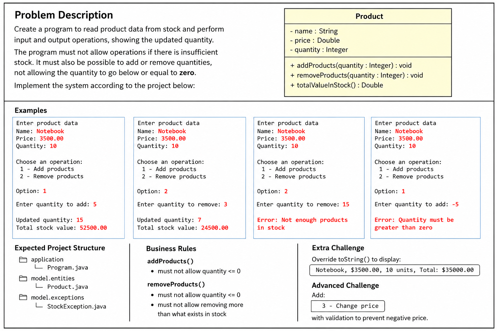

# inventorySystem
Inventory Management System developed in Java for product and stock control. Features include product registration, inventory updates, stock entry/removal, validations, and exception handling. Built using OOP concepts to improve backend development and Java programming skills.

  
 
